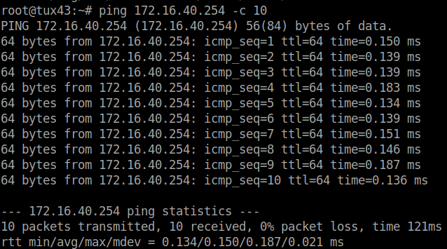
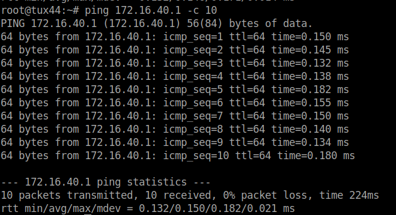
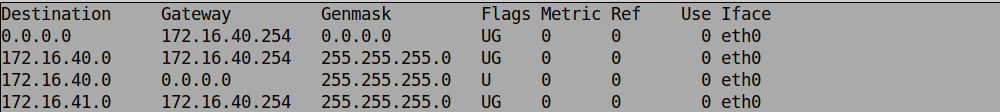
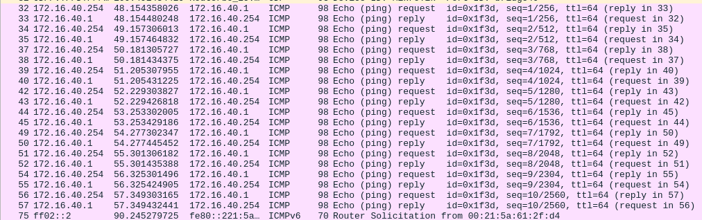
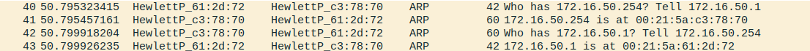

<h1>RCOM Project 2</h1>

Gonçalo  Miranda (up202108773)
 
Sophie Large (up202303141)

## Table of Contents
1. [**Project's idea description**](#1---introduction)
2. [**Related apps / services / systems**](#2---related-apps--services--systems)

## Introduction

bloat bloat boat

## Part 1 - Develoment of the Download Application (app.c and app.h)
## Part 2 - Experiences

### Experience 1 - Configure an IP Network

#### Step By Step

Note that, in this experience, the workbench used was workbench 4.

1. Connect E0 on Tux**Y**3 and Tux**Y**4 on any of the switch ports.

2. Configure Tux**Y**3 and Tux**Y**4, by performing the following commands:
    - Tux**Y**3
     
    <code> ifconfig eth0 up
      ifconfig eth0 172.16.**Y**0.**1**/24
    </code> 
    - Tux**Y**4
     
    <code> ifconfig eth0 up
      ifconfig eth0 172.16.**Y**0.**254**/24
    </code> 
3. Now we can check both the IP and MAC adresses of both computers:
    - TuxY3:
        - IP Address: 172.16.**Y**0.1/24
        - MAC Address: 00:21:5a:61:2f:d4
    - TuxY4:
        - IP Address: 172.16.**Y**0.254/24
        - MAC Address: 00:21:5a:5a:7b:ea

4. We now can test the connectivity between the computers by pinging each other (TuxY3 pings TuxY4 and vice-versa).

    <code>
    TuxY3: ping 172.16.**Y**0.254 -c 10
    </code>

    
     
    <code>
    TuxY4: ping 172.16.**Y**0.1 -c 10
    </code>

    
         
        The connection is working in case all the packets are correctly recieved.
         
5. Now, we can check the forwarding and the ARP tables. We're doing it on Tux**Y**3.
     
    <code> in: route -n
     out: 
    </code>
     
    <code> in: arp -a
     out: ? (172.16.40.254) at 00:21:5a:5a:7b:ea [ether] on eht0
    </code>
6. We are now deleting the arp table entries in Tux**Y**3.
    
    <code>
    arp -d 172.16.40.254
    </code>

    To test if the deletion occurred correctly, we can perform
    <code>
    in: arp -a
     
    out: 
    </code>
7. Now, we can start Wireshark in Tux**Y**3.eth0 and start capturing packets.

8. After that, we can ping Tux**Y**4 from Tux**Y**3 10 times.
    
    <code>
    ping 172.16.40.254 -c 10
     </code>
 

9. Finally, we can stop capturing the packets.

10. When saving the logs and analysing them, we've got the following:

    

#### Questions

1. What are the ARP packets and what are they used for?

    The ARP (*Address Resolution Protocol*) packets are used to establish a connection between an IP and a MAC address.

2. What are the MAC and IP addresses of ARP packets and why?

    The ARP packets carry 2 IP addresses: the destiny machine's IP address (172.16.**Y**0.254, Tux**Y**4) the the source machine's IP address (172.16.**Y**0.01, Tux**Y**3). Tux**Y**4 then proceeds to send another ARP packet to Tux**Y**3, that contains its MAC address (00:21:5a:5a:7b:ea).

3. What packets does the ping command generate?

    While the destiny's MAC address isn't recieved, *ping* generates ARP packets. After connecting the IP address to the corresponding MAC address,it generates ICMP (*Internet Control Message Protocol*) packets.

4. What are the MAC and IP addresses of the ping packets?

    The IP and MAC addresses used in ICMP are the ones from the machines in use - in this case, Tux**Y**3 and Tux**Y**4. 

5. How to determine if a receiving Ethernet frame is ARP, IP, ICMP?

    Each frame's protocal designation can be checked in the "Protocol" column of the Wireshark capture. The protoccol is usually indicated inthe first 2 bytes of the frame, in its header.

6. How to determine the length of a receiving frame?

    Wireshark has a column that specifies the frame size,in bytes. Usually that is also present in the frame's header.

7. What is the loopback interface and why is it important?

    It's a virtual interface that's always reachable as long as one of the switch's interfaces are on. Because of this, its possible to periodically check if the network's connections are properly configured.

### Experience 2 - Implement two bridges in a switch

#### Step By Step
Note that, in this experience, the workbench used was workbench 4.

1. Connect E0 on Tux**Y**2 to any of the switch ports. After that,configure Tux**Y**2, by performing the following commands:
     
    <code> ifconfig eth0 up
      ifconfig eth0 172.16.**Y**1.**1**/24
    </code> 

2. Now, we can creating two bridges in the switch, using the following commands on GTKTerm.
    - Bridge**Y**0:
        
        <code>
        /interface bridge add name=bridgeY0
        </code>
    - Bridge**Y**1:
        
        <code>
        /interface bridge add name=bridgeY1
        </code>

3. Afterwards, we can remove the ports where Tux**Y**2, Tux**Y**3, and Tux**Y**4 are connected from the default bridge and add them to the corresponding ports to bridge**Y**0 and bridge**Y**1.
    - Removing the original ports:
        
        <code>
        /interface bridge port remove [find interface=ether1] 
         
        /interface bridge port remove [find interface=ether2] 
         
        /interface bridge port remove [find interface=ether3]
        </code>

    - Adding the current ports:
        
        <code>
        /interface bridge port add bridge=bridge50 interface=ether1
         
        /interface bridge port add bridge=bridge50 interface=ether2 
         
        /interface bridge port add bridge=bridge51 interface=ether3
        </code>
         
4. Now, we should switch to Tux**Y**3 and start monitoring the packets.

5. Ping Tux**Y**4 and Tux**Y**2 from Tux**Y**3.
     
    <code>
        $ ping 172.16.**Y**0.254 -c 10
    </code>

    In Tux**Y**4, all 10 packets have been recieved successfully!
     
    <code>
        $ ping 172.16.**Y**1.1 -c 10
    </code>

    In Tux**Y**2 -> connect: Network is unreachable

6. Afterwards, stop the capture.

7. Proceed by starting the capture of eth0 in Tux**Y**2, Tux**Y**3 and Tux**Y**4.

8. From Tux**Y**3, ping 172.16.**Y**0.255.

    <code>
        $ ping 172.16.**Y**0.255 -c 10
    </code>

9. Stop the captures.

10. Restart the previous captures.

11. From Tux**Y**2, ping 172.16.**Y**1.255.

#### Questions

1. How to configure bridgeY0?

    In order to connect Tux**Y**3 and Tux**Y**4, bridge**Y**0 was configured, creating a subnet. To configure the bridge properly, we delete previous configurations and default connections when the machines first connected and configure new ports that connect to each machine. We can do this by using the commands states in the previous step-by-step guide.

2. How many broadcast domains are there? How can you conclude it from the logs?

    Since we implemented two bridges (bridge**Y**0 and bridge**Y**0), there are two broadcast domains. We can conclude this because, after analyzing the Wireshark logs, Tux**Y**3 got a response from Tux**Y**4 but not from Tux**Y**2, since they're on different bridges and, therefore, different broadcast domains.

### Experience 3 - Configure a router in Linux

#### Step By Step

Note that, in this experience, the workbench used was workbench 5.

1. We need to configure Tux**Y**4 as a router, by:

    - Connect Tux**Y**4's eth1 to a switch port.

    - After connecting the cables, config the port itself.
    
        <code>$ ifconfig eth1 172.16.**Y**1.253/24</code>

    - Connect Tux**Y**2 to the switch console and add it to bridge**Y**1.
        
        In GTKTerm:

        <code> /interface bridge port remove [find interface=ether**XX**]
        
        /interface bridge port add interface=ether**XX** bridge=bridge**Y**1
        </code>, being XX the switch's port number.

    - Enable the IP forwarding on Tux**Y**4.

        <code>$ echo 1 > /proc/sys/net/ipv4/ip_forward</code>

    - Disable ICMP echo-ignore broadcast on Tux**Y**4.

        <code>$ echo 1 > /proc/sys/net/ipv4/icmp_echo_ignore_broadcasts</code>

2. Now, check the MAC and IP addresses in Tux**Y**4's eth0 and eth1.

    <code> $ ifconfig </code>

    out:
    - eth0:
        
        MAC Address: 00:21:5a:c3:78:70
        IP Address: 172.16.**Y**0.254
     
     - eth1:
        
        MAC Address: 00:c0:df:08:d5:b0
        IP Address: 172.16.**Y**1.253

3. Reconfigure Tux**Y**3 and Tux**Y**2 so that they can reach each other.
    
    - Tux**Y**2: 
        
        <code>$ route add -net 172.16.50.0/24 gw 172.16.51.253 </code>
    - Tux**Y**3: 

        <code>$ route add -net  172.16.**Y**1.0/24 gw 172.16.**Y**0.254 </code>

4. Now, check the routes available in each machine.

    <code>$ route -n</code>

5. Start capturing packets with Wireshark.

6. From Tux**Y**3, ping the other network interfaces and check their connectivity.
    
    in:

    <code>$ ping 172.16.**Y**0.254 -c 10</code>

    <code>$ ping 172.16.**Y**1.253 -c 10</code>

    <code>$ ping 172.16.**Y**1.1 -c 10</code>

    out:
        
        All 10 packets for each ping call recieved correctly in every machine.

7. Stop the log capture and check the logs.

8. Now, start a Wireshark capture on Tux**Y**4's eth0 and eth1.

9. In each machine, clean the ARP tables.
    - Tux**Y**2:

        <code>$ arp -d 172.16.**Y**1.253</code>

    - Tux**Y**3:

        <code>$ arp -d 172.16.**Y**0.254</code>

    - Tux**Y**4:

        <code>$ arp -d 172.16.**Y**0.1</code>
        <code>$ arp -d 172.16.**Y**1.1</code>

10. In Tux**Y**3, ping Tux**Y**2.

    <code>$ ping 172.16.Y1.1 c 10</code>

11. Stop both Tux**Y**4 Wireshark captures.

#### Questions
1. What are the commands required to configure this experience?

    The necessary commands to configure the experience are the ones displayed in the step-by-step guide presented before.

2. What routes are there in the tuxes? What are their meaning?

    There is a route on Tux**Y**2 and another in Tux**Y**3. Both those routes have Tux**Y**4 as the gateway, since Tux**Y**4 is the only one common to the created bridges (it's a router).

3. What information does an entry of the forwarding table contain? 

    Each entry of the forwarding table has the destiny address and its gateway.

4. What ARP messages, and associated MAC addresses, are observed and why?

    When pinging Tux**Y**2 from Tux**Y**3, the ARP packages carry the IP and MAC addresses of Tux**Y**3 and Tux**Y4** instead of the Tux**Y**2 as the destiny address. This happens because of the routing we created: here, Tux**Y**2's address is not known by Tux**Y**3. The latter only knows the Tux**Y**4's address (gateway), that will later lead to Tux**Y**2.

    

5. What ICMP packets are observed and why? 

    The ICMP packets carry the source (Tux**Y**3) and destiny's IP addresses (Tux**Y**2). The fact that those two are the IP's carried means the network is correctly configured.

    
    
6. What are the IP and MAC addresses associated to ICMP packets and why?

    Each ICMP packet observed after the ping from Tux**Y**3 to Tux**Y**2, carry Tux**Y**3's IP address as the source IP address and the Tux**Y**3's IP address as the destiny address, however, the ICMP packets carry Tux**Y**4's MAC address, due to the fact that this machine is the one connecting the two bridges.

### Experience 4 - Configure a Commercial Router and Implement NAT

#### Step By Step

Note that, in this experience, the workbench used was workbench 5.

1. Connect the router's eth1 port to the port **Y**1 of the server rack in the lab - NAT is, by default, enabled. 

2. Connect the router's eth2 port to the switch.

3. Delete the default ports of the switch's etherXX (XX represents the port number on which the cable is connected) and connect it to bridge**Y**1.

    - Using GTKTerm, in the switch's console, run:

        <code>
        /interface bridge port remove [find interface=etherXX]

        /interface bridge port add bridge=bridge**Y**1 interface=etherXX
        </code>

4. Switch the cable that was connected to the switch to the router.

5. Reset the router's settings and configure its IP address.

    - Using GTKTerm, switch the baudrate to 115200 and the serial port to /dev/ttyS0. After that, run:

        <code>
        /system reset-configuration
        </code>

    - Login with username "admin" and no password.

    - Run:

        <code>
        /ip address add address=172.16.1.**Y**9/24 interface=ether1
        /ip address add address=172.16.**Y**1.254/24 interface=ether2
        </code>

6. Configure all the computer's default routes, as well as the router's.
    - Tux**Y**2:
        
        <code>$ route add default gw 172.16.**Y**1.254</code>

    - Tux**Y**3:
        
        <code>$ route add default gw 172.16.**Y**0.254</code>
    
    - Tux**Y**4:
        
        <code> $ route add default gw 172.16.**Y**1.254</code>
    
    - Using GTKTerm on the router's console, run:
        <code>
         /ip route add dst-address=172.16.**Y**0.0/24 gateway=172.16.**Y**1.253

        /ip route add dst-address=0.0.0.0/0 gateway=172.16.1.254
        </code>

7. Start a Wireshark capture on Tux**Y**3  to check if it can ping all the network interfaces of Tux**Y**2, Tux**Y**4 and the router.
    
    In:

    <code>$ ping 172.16.**Y**0.254 -c 10

    $ ping 172.16.**Y**1.1 -c 10

    $ ping 172.16.**Y**1.254 -c 10
    </code>

    Out:
    
    All 10 packets for each ping call recieved correctly in every machine.

8. On Tux**Y**2, disable accept_redirects.
    <code>
    
    $ sysctl net.ipv4.conf.eth0.accept_redirects=0

    $ sysctl net.ipv4.conf.all.accept_redirects=0
    </code>

9. Remove the route that connects Tux**Y**2 to Tux**Y**4.

    <code>$ route del -net 172.16.**Y**0.0 gw 172.16.**Y**1.253 netmask 255.255.255.0</code>

10. On Tux**Y**2, start a Wireshark capture and ping Tux**y**3.
    In:

    <code>$ ping 172.16.**Y**0.1</code>

    Out:
        All 10 packets of the ping call recieved correctly (connection was using the proper router instead of Tux**Y**4 as a router).

11. Now, lets check the connection's route.
    In:

    <code>$ traceroute -n 172.16.**Y**0.1</code>

    Out:
    
    traceroute to 172.16.**Y**0.1 (172.16.**Y**0.1), 30 hops max, 60 byte packets

    1  172.16.**Y**1.254 (172.16.**Y**1.254)  0.200 ms  0.204 ms  0.224 ms

    2  172.16.**Y**1.253 (172.16.**Y**1.253)  0.354 ms  0.345 ms  0.344 ms

    3  tux**Y**1 (172.16.**Y**0.1)  0.596 ms  0.587 ms  0.575 ms
    
12. Re-create the route that connects Tux**Y**2 to Tux**Y**4.

    <code>$ route add -net 172.16.**Y**0.0/24 gw 172.16.**Y**1.253</code>

13. Trace the route from Tux**Y**2 to Tux**Y**3.

    <code>$ traceroute -n 172.16.**Y**0.1</code>

    Out:
        
    traceroute to 172.16.**Y**0.1 (172.16.**Y**0.1), 30 hops max, 60 byte packets
    
    1  172.16.**Y**1.253 (172.16.**Y**1.253)  0.196 ms  0.180 ms  0.164 ms

    2  tux**Y**1 (172.16.**Y**0.1)  0.414 ms  0.401 ms  0.375 ms

14. Reactivate accept_redirects.

    <code>
    $ sysctl net.ipv4.conf.eth0.accept_redirects=1

    $ sysctl net.ipv4.conf.all.accept_redirects=1
    </code>

15. From Tux**Y**3, ping the Lab's router.

    <code>$ ping 172.1.254</code>

16. Deactivate the router's NAT.
    On GTKTerm, on the router's console:
        <code>/ip firewall net disable 0</code>
    
17. On Tux**Y**3, ping the Lab's router again.

    In:
        
        <code>ping 172.16.1.254</code>

    Out:
        
        No connection.

18. Reactivate the router's NAT.

    <code>/ip firewall nat enable 0</code>

#### Questions

1. How to configure a static route in a commercial router?

    Resetar as suas configurações, adicioná-lo à rede interna (à bridge correspondente) e atribuir um IP interno e um IP externo.

2. What are the paths followed by the packets in the experiments carried out and 
why?

    Na primeira experiência, sem a ligação do Tux52 ao Tux54, os pacotes de dados foram reencaminhados (ICMP redirect) através do router implementado até ao endereço IP de destino  
    Já na segunda experiência não houve qualquer reencaminhamento pois a ligação mais curta da rede estava disponível.
img1
img2
img3
img4

3. How to configure NAT in a commercial router?
    Com o comando `/ip firewall nat enable 0` no terminal do router

4. What does NAT do?
    O NAT (Network Address Translation) traduz endereços da rede local para um único endereço público, e viceversa. Assim, quando um pacote é enviado para uma rede externa, é enviado com o endereço publico como origem. Quando o computador de destino responde, envia a resposta para esse endereço público, que é depois traduzido de volta para o endereço local de destino que enviou o pacote em primeiro lugar. Deste modo, é possivel reduzir o numero de endereços publicos utilizados.
#### Step by Step
### Experience 5 - DNS

### Experience 6 - TCP Connections

## Conclusions

bloat bloat bloat

## Annexes