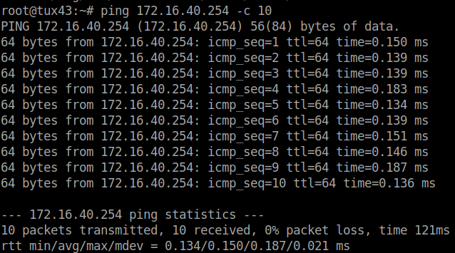
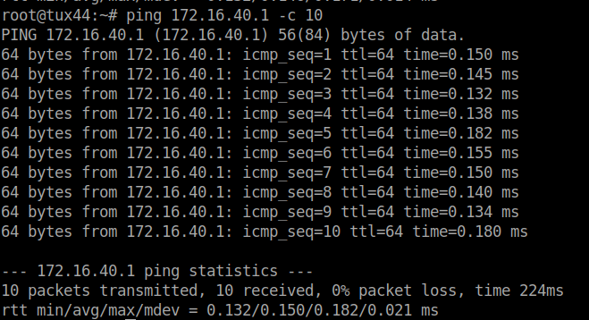
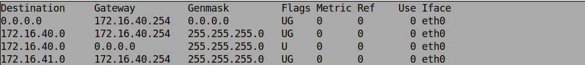
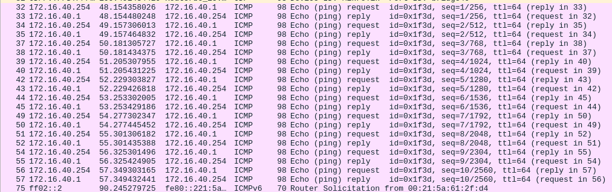
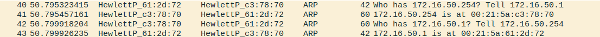
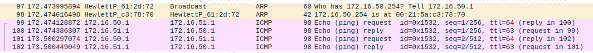

<div align='center'>

<h1>RCOM Project 2</h1>

<p>
Gonçalo  Miranda (up202108773)
<br>
Sophie Large (up202303141)

</p>
</div>


## Table of Contents
Certainly! Here's an index based on the headings in the provided document:

1. [Introduction](#introduction)
3. [Part 1 - Development of the Download Application (app.c and app.h)](#part-1---develoment-of-the-download-application-appc-and-apph)
    1. [Architecture of the Application](#architecture-of-the-application)
4. [Part 2 - Experiences](#part-2---experiences)
    1. [Experience 1 - Configure an IP Network](#experience-1---configure-an-ip-network)
        - [Step By Step](#step-by-step)
        - [Questions](#questions)
    2. [Experience 2 - Implement two bridges in a switch](#experience-2---implement-two-bridges-in-a-switch)
        - [Step By Step](#step-by-step)
        - [Questions](#questions)
    3. [Experience 3 - Configure a router in Linux](#experience-3---configure-a-router-in-linux)
        - [Step By Step](#step-by-step)
        - [Questions](#questions)
    4. [Experience 4 - Configure a Commercial Router and Implement NAT](#experience-4---configure-a-commercial-router-and-implement-nat)
        - [Step By Step](#step-by-step)
        - [Questions](#questions)
    5. [Experience 5 - DNS](#experience-5---dns)
        - [Step By Step](#step-by-step)
        - [Questions](#questions)
    6. [Experience 6 - TCP Connections](#experience-6---tcp-connections)
        - [Step By Step](#step-by-step)
        - [Questions](#questions)
5. [Conclusions](#conclusions)
6. [Annexes](#annexes)
    - [1. Code](#1-code)
    - [2. Wireshark Captures](#2-wireshark-captures)

Feel free to let me know if you need anything else or if you want further customization!


## Introduction

The goal of this project was to set up a small network and prove that it is correctly setup using a download application, which was also developed for this project.

## Part 1 - Develoment of the Download Application (app.c and app.h)

This part of the project consists in the development of a small app that downloads files using the FTP protocol. The app works when provided with an URL such as ```ftp://[<username>[:<password>]@]<host>[:<port>]/<path```.

Example: ```ftp://ftp.up.pt/pub/hello.txt```

During the development of the app part of the project, we had the chance to understand Unix utilities to handle URLs and to communicate with sockets, the FTP protocol and the concept of DNS.

### Architecture of the Application

1. Parsing the URL string given as the argument to the program to extract its fragments, such as the username, password, host, port, and path.

2. Connecting to the host on the specified port (being 21 t he default port, the standard FTP control port).

3. Entering passive mode and recieving the host and port of the data connection.

4. Connecting to the data connection host and port.

5. Notifying the server that it should start transfering the desired file.

6. Reading the incoming data from the server and writing it locally to the download.<extention> file, being the extention the last part of the path (last string after the last "/").

7. Closing the connections and terminating the app.

TCP sockets mediate the network communication.
By making use of the URL parser we designed, via a state machine and regular expressions, and getaddrinfo(), the FTP server’s IP and con-
trol port are obtained (in case there's no port specified, 21 is the value assumed). A TCP connection is established and the pro-
gram starts sending commands through the control
connection, which will be responded by the server. Those responses carry response codes, that are properly extracted and checked to understand if the program is working as intended. If any of the response codes sent by the server doesn't match the expected code, the program is terminated with exit code -1.
In case there's no username specified by the user, "anonymous" is assumed as the username, since it's the default value we decided to provied.
After that, passive mode is entered and, if its successfully entered,
the server responds with code 227 and the host's IP and port.
After establishing a data connection , the retr command is sent and, after that, the buffers of data from the data connection begin getting read into a file named "download.```<extention>```", where the extention is the last string after the last "/" in the file path provided by the user.
Finally, the connection is closed and the program terminates.

## Part 2 - Experiences

### Experience 1 - Configure an IP Network

#### Step By Step

Note that, in this experience, the workbench used was workbench 4.

1. Connect E0 on Tux**Y**3 and Tux**Y**4 on any of the switch ports.

2. Configure Tux**Y**3 and Tux**Y**4, by performing the following commands:
    - Tux**Y**3
    <br>
    <code>$ ifconfig eth0 up
    <br>$ ifconfig eth0 172.16.**Y**0.**1**/24
    </code> 
    - Tux**Y**4
    <br>
    <code>$ ifconfig eth0 up
    <br>$ ifconfig eth0 172.16.**Y**0.**254**/24
    </code> 
3. Now we can check both the IP and MAC adresses of both computers:
    - TuxY3:
        - IP Address: 172.16.**Y**0.1/24
        - MAC Address: 00:21:5a:61:2f:d4
    - TuxY4:
        - IP Address: 172.16.**Y**0.254/24
        - MAC Address: 00:21:5a:5a:7b:ea

4. We now can test the connectivity between the computers by pinging each other (TuxY3 pings TuxY4 and vice-versa).
    
    TuxY3:
    
    <code>
    $ ping 172.16.**Y**0.254 -c 10
    </code>

    
    <br>

    TuxY4:

    <code>
    $ ping 172.16.**Y**0.1 -c 10
    </code>

    
        <br>
        The connection is working in case all the packets are correctly recieved.
        <br>
        
5. Now, we can check the forwarding and the ARP tables. We're doing it on Tux**Y**3.
    <br>
    In:

    <code>$ route -n</code>

    out: 

    <br>
    In:

    <code>$ arp -a</code>

    out:

    <code> ? (172.16.40.254) at 00:21:5a:5a:7b:ea [ether] on eht0
    </code>
6. We are now deleting the arp table entries in Tux**Y**3.
    In:

    <code>
    $ arp -d 172.16.40.254
    </code>

    To test if the deletion occurred correctly, we can perform
    
    In:

    <code>$ arp -a</code>
    
    out: 
    
    No entries on the table
    
7. Now, we can start Wireshark in Tux**Y**3.eth0 and start capturing packets.

8. After that, we can ping Tux**Y**4 from Tux**Y**3 10 times.
    
    <code>
    $ ping 172.16.40.254 -c 10
     </code>
<br>

9. Finally, we can stop capturing the packets.

10. When saving the logs and analysing them, we've got the following:

    

#### Questions

1. What are the ARP packets and what are they used for?

    The ARP (*Address Resolution Protocol*) packets are used to establish a connection between an IP and a MAC address.

2. What are the MAC and IP addresses of ARP packets and why?

    The ARP packets carry 2 IP addresses: the destiny machine's IP address (172.16.**Y**0.254, Tux**Y**4) the the source machine's IP address (172.16.**Y**0.01, Tux**Y**3). Tux**Y**4 then proceeds to send another ARP packet to Tux**Y**3, that contains its MAC address (00:21:5a:5a:7b:ea).

3. What packets does the ping command generate?

    While the destiny's MAC address isn't recieved, *ping* generates ARP packets. After connecting the IP address to the corresponding MAC address,it generates ICMP (*Internet Control Message Protocol*) packets.

4. What are the MAC and IP addresses of the ping packets?

    The IP and MAC addresses used in ICMP are the ones from the machines in use - in this case, Tux**Y**3 and Tux**Y**4. 

5. How to determine if a receiving Ethernet frame is ARP, IP, ICMP?

    Each frame's protocal designation can be checked in the "Protocol" column of the Wireshark capture. The protoccol is usually indicated inthe first 2 bytes of the frame, in its header.

6. How to determine the length of a receiving frame?

    Wireshark has a column that specifies the frame size,in bytes. Usually that is also present in the frame's header.

7. What is the loopback interface and why is it important?

    It's a virtual interface that's always reachable as long as one of the switch's interfaces are on. Because of this, its possible to periodically check if the network's connections are properly configured.

### Experience 2 - Implement two bridges in a switch

#### Step By Step
Note that, in this experience, the workbench used was workbench 4.

1. Connect E0 on Tux**Y**2 to any of the switch ports. After that,configure Tux**Y**2, by performing the following commands:
    <br>
    <code>$ ifconfig eth0 up
    <br>$ ifconfig eth0 172.16.**Y**1.**1**/24
    </code> 

2. Now, we can creating two bridges in the switch, using the following commands on GTKTerm.
    - Bridge**Y**0:
        
        <code>
        /interface bridge add name=bridgeY0
        </code>
    - Bridge**Y**1:
        
        <code>
        /interface bridge add name=bridgeY1
        </code>

3. Afterwards, we can remove the ports where Tux**Y**2, Tux**Y**3, and Tux**Y**4 are connected from the default bridge and add them to the corresponding ports to bridge**Y**0 and bridge**Y**1.
    - Removing the original ports:
        
        <code>
        /interface bridge port remove [find interface=ether1] 
        <br>
        /interface bridge port remove [find interface=ether2] 
        <br>
        /interface bridge port remove [find interface=ether3]
        </code>

    - Adding the current ports:
        
        <code>
        /interface bridge port add bridge=bridge**Y**0 interface=ether1
        <br>
        /interface bridge port add bridge=bridge**Y**0 interface=ether2 
        <br>
        /interface bridge port add bridge=bridge**Y**1 interface=ether3
        </code>
        <br>
4. Now, we should switch to Tux**Y**3 and start monitoring the packets.

5. Ping Tux**Y**4 and Tux**Y**2 from Tux**Y**3.
    <br>
    In:

    <code>
        $ ping 172.16.**Y**0.254 -c 10
    </code>

    Out: 
    
    In Tux**Y**4, all 10 packets have been recieved successfully!

    <br>
    In:

    <code>
        $ ping 172.16.**Y**1.1 -c 10
    </code>

    Out:
    
    In Tux**Y**2 -> connect: Network is unreachable

6. Afterwards, stop the capture.

7. Proceed by starting the capture of eth0 in Tux**Y**2, Tux**Y**3 and Tux**Y**4.

8. From Tux**Y**3, ping 172.16.**Y**0.255.

    <code>
        $ ping 172.16.**Y**0.255 -c 10
    </code>

9. Stop the captures.

10. Restart the previous captures.

11. From Tux**Y**2, ping 172.16.**Y**1.255.

12. Enable ICMP

13. IP forwarding

#### Questions

1. How to configure bridgeY0?

    In order to connect Tux**Y**3 and Tux**Y**4, bridge**Y**0 was configured, creating a subnet. To configure the bridge properly, we delete previous configurations and default connections when the machines first connected and configure new ports that connect to each machine. We can do this by using the commands states in the previous step-by-step guide.

2. How many broadcast domains are there? How can you conclude it from the logs?

    Since we implemented two bridges (bridge**Y**0 and bridge**Y**0), there are two broadcast domains. We can conclude this because, after analyzing the Wireshark logs, Tux**Y**3 got a response from Tux**Y**4 but not from Tux**Y**2, since they're on different bridges and, therefore, different broadcast domains.

### Experience 3 - Configure a router in Linux

#### Step By Step

Note that, in this experience, the workbench used was workbench 5.

1. We need to configure Tux**Y**4 as a router, by:

    - Connect Tux**Y**4's eth1 to a switch port.

    - After connecting the cables, config the port itself.
    
        <code>$ ifconfig eth1 172.16.**Y**1.253/24</code>

    - Connect Tux**Y**2 to the switch console and add it to bridge**Y**1.
        
        In GTKTerm:

        <code> /interface bridge port remove [find interface=ether**XX**]
        
        /interface bridge port add interface=ether**XX** bridge=bridge**Y**1
        </code>, being XX the switch's port number.

    - Enable the IP forwarding on Tux**Y**4.

        <code>$ echo 1 > /proc/sys/net/ipv4/ip_forward</code>

    - Disable ICMP echo-ignore broadcast on Tux**Y**4.

        <code>$ echo 1 > /proc/sys/net/ipv4/icmp_echo_ignore_broadcasts</code>

2. Now, check the MAC and IP addresses in Tux**Y**4's eth0 and eth1.

    <code> $ ifconfig </code>

    out:
    - eth0:
        
        MAC Address: 00:21:5a:c3:78:70
        IP Address: 172.16.**Y**0.254
     
     - eth1:
        
        MAC Address: 00:c0:df:08:d5:b0
        IP Address: 172.16.**Y**1.253

3. Reconfigure Tux**Y**3 and Tux**Y**2 so that they can reach each other.
    
    - Tux**Y**2: 
        
        <code>$ route add -net 172.16.50.0/24 gw 172.16.51.253 </code>
    - Tux**Y**3: 

        <code>$ route add -net  172.16.**Y**1.0/24 gw 172.16.**Y**0.254 </code>

4. Now, check the routes available in each machine.

    <code>$ route -n</code>

5. Start capturing packets with Wireshark.

6. From Tux**Y**3, ping the other network interfaces and check their connectivity.
    
    in:

    <code>$ ping 172.16.**Y**0.254 -c 10</code>

    <code>$ ping 172.16.**Y**1.253 -c 10</code>

    <code>$ ping 172.16.**Y**1.1 -c 10</code>

    out:
        
        All 10 packets for each ping call recieved correctly in every machine.

7. Stop the log capture and check the logs.

8. Now, start a Wireshark capture on Tux**Y**4's eth0 and eth1.

9. In each machine, clean the ARP tables.
    - Tux**Y**2:

        <code>$ arp -d 172.16.**Y**1.253</code>

    - Tux**Y**3:

        <code>$ arp -d 172.16.**Y**0.254</code>

    - Tux**Y**4:

        <code>$ arp -d 172.16.**Y**0.1</code>
        <code>$ arp -d 172.16.**Y**1.1</code>

10. In Tux**Y**3, ping Tux**Y**2.

    <code>$ ping 172.16.Y1.1 c 10</code>

11. Stop both Tux**Y**4 Wireshark captures.

#### Questions
1. What are the commands required to configure this experience?

    The necessary commands to configure the experience are the ones displayed in the step-by-step guide presented before.

2. What routes are there in the tuxes? What are their meaning?

    There is a route on Tux**Y**2 and another in Tux**Y**3. Both those routes have Tux**Y**4 as the gateway, since Tux**Y**4 is the only one common to the created bridges (it's a router).

3. What information does an entry of the forwarding table contain? 

    Each entry of the forwarding table has the destiny address and its gateway.

4. What ARP messages, and associated MAC addresses, are observed and why?

    When pinging Tux**Y**2 from Tux**Y**3, the ARP packages carry the IP and MAC addresses of Tux**Y**3 and Tux**Y4** instead of the Tux**Y**2 as the destiny address. This happens because of the routing we created: here, Tux**Y**2's address is not known by Tux**Y**3. The latter only knows the Tux**Y**4's address (gateway), that will later lead to Tux**Y**2.

    

5. What ICMP packets are observed and why? 

    The ICMP packets carry the source (Tux**Y**3) and destiny's IP addresses (Tux**Y**2). The fact that those two are the IP's carried means the network is correctly configured.

    
    
6. What are the IP and MAC addresses associated to ICMP packets and why?

    Each ICMP packet observed after the ping from Tux**Y**3 to Tux**Y**2, carry Tux**Y**3's IP address as the source IP address and the Tux**Y**3's IP address as the destiny address, however, the ICMP packets carry Tux**Y**4's MAC address, due to the fact that this machine is the one connecting the two bridges.

### Experience 4 - Configure a Commercial Router and Implement NAT

#### Step By Step

Note that, in this experience, the workbench used was workbench 5.

1. Connect the router's eth1 port to the port **Y**1 of the server rack in the lab - NAT is, by default, enabled. 

2. Connect the router's eth2 port to the switch.

3. Delete the default ports of the switch's etherXX (XX represents the port number on which the cable is connected) and connect it to bridge**Y**1.

    - Using GTKTerm, in the switch's console, run:

        <code>
        /interface bridge port remove [find interface=etherXX]

        /interface bridge port add bridge=bridge**Y**1 interface=etherXX
        </code>

4. Switch the cable that was connected to the switch to the router.

5. Reset the router's settings and configure its IP address.

    - Using GTKTerm, switch the baudrate to 115200 and the serial port to /dev/ttyS0. After that, run:

        <code>
        /system reset-configuration
        </code>

    - Login with username "admin" and no password.

    - Run:

        <code>
        /ip address add address=172.16.1.**Y**9/24 interface=ether1
        /ip address add address=172.16.**Y**1.254/24 interface=ether2
        </code>

6. Configure all the computer's default routes, as well as the router's.
    - Tux**Y**2:
        
        <code>$ route add default gw 172.16.**Y**1.254</code>

    - Tux**Y**3:
        
        <code>$ route add default gw 172.16.**Y**0.254</code>
    
    - Tux**Y**4:
        
        <code> $ route add default gw 172.16.**Y**1.254</code>
    
    - Using GTKTerm on the router's console, run:
        <code>
         /ip route add dst-address=172.16.**Y**0.0/24 gateway=172.16.**Y**1.253

        /ip route add dst-address=0.0.0.0/0 gateway=172.16.1.254
        </code>

7. Start a Wireshark capture on Tux**Y**3  to check if it can ping all the network interfaces of Tux**Y**2, Tux**Y**4 and the router.
    
    In:

    <code>$ ping 172.16.**Y**0.254 -c 10

    $ ping 172.16.**Y**1.1 -c 10

    $ ping 172.16.**Y**1.254 -c 10
    </code>

    Out:
    
    All 10 packets for each ping call recieved correctly in every machine.

8. On Tux**Y**2, disable accept_redirects.
    <code>
    
    $ sysctl net.ipv4.conf.eth0.accept_redirects=0

    $ sysctl net.ipv4.conf.all.accept_redirects=0
    </code>

9. Remove the route that connects Tux**Y**2 to Tux**Y**4.

    <code>$ route del -net 172.16.**Y**0.0 gw 172.16.**Y**1.253 netmask 255.255.255.0</code>

10. On Tux**Y**2, start a Wireshark capture and ping Tux**y**3.
    In:

    <code>$ ping 172.16.**Y**0.1</code>

    Out:
        All 10 packets of the ping call recieved correctly (connection was using the proper router instead of Tux**Y**4 as a router).

11. Now, lets check the connection's route.
    In:

    <code>$ traceroute -n 172.16.**Y**0.1</code>

    Out:
    
    traceroute to 172.16.**Y**0.1 (172.16.**Y**0.1), 30 hops max, 60 byte packets

    1  172.16.**Y**1.254 (172.16.**Y**1.254)  0.200 ms  0.204 ms  0.224 ms

    2  172.16.**Y**1.253 (172.16.**Y**1.253)  0.354 ms  0.345 ms  0.344 ms

    3  tux**Y**1 (172.16.**Y**0.1)  0.596 ms  0.587 ms  0.575 ms
    
12. Re-create the route that connects Tux**Y**2 to Tux**Y**4.

    <code>$ route add -net 172.16.**Y**0.0/24 gw 172.16.**Y**1.253</code>

13. Trace the route from Tux**Y**2 to Tux**Y**3.

    <code>$ traceroute -n 172.16.**Y**0.1</code>

    Out:
        
    traceroute to 172.16.**Y**0.1 (172.16.**Y**0.1), 30 hops max, 60 byte packets
    
    1  172.16.**Y**1.253 (172.16.**Y**1.253)  0.196 ms  0.180 ms  0.164 ms

    2  tux**Y**1 (172.16.**Y**0.1)  0.414 ms  0.401 ms  0.375 ms

14. Reactivate accept_redirects.

    <code>
    $ sysctl net.ipv4.conf.eth0.accept_redirects=1

    $ sysctl net.ipv4.conf.all.accept_redirects=1
    </code>

15. From Tux**Y**3, ping the Lab's router.

    <code>$ ping 172.1.254</code>

16. Deactivate the router's NAT.
    On GTKTerm, on the router's console:
        <code>/ip firewall net disable 0</code>
    
17. On Tux**Y**3, ping the Lab's router again.

    In:
        
        <code>ping 172.16.1.254</code>

    Out:
        
        No connection.

18. Reactivate the router's NAT.

    <code>/ip firewall nat enable 0</code>

#### Questions

1. How to configure a static route in a commercial router?

    We start by reseting its settings, add it to the corresponding bridge and give it its own external and internal IP address.

2. What are the paths followed by the packets in the experiments carried out and why?

    In the first part of the experience, where Tux**Y**2 wasn't connected to Tux**Y**4,the data packets were redirected (ICMP redirect) through the implementes router to the destiny IP address.<br>
    In the second part of the experience, there were no redirects, since the shortest connection in the network was available.
img1
img2
img3
img4

3. How to configure NAT in a commercial router?
    Using the GTK Terminal command <code>/ip firewall nat enable 0</code> in the router's terminal.

4. What does NAT do?
    NAT (Network Address Translation) translates addresses from the local network to a single public address and vice-versa. Because of this, when a packet is sent to an external network, the package is sent with the public address as the source. When the destiny machine sends back a response, it sends that response to the public address, which is than re-translated again to the local address that sent the packet in the first place. This is useful, since we can reduce the number of public addresses used on a network.

### Experience 5 - DNS

#### Step by Step

Note that, in this experience, the workbench used was workbench 4 and in room I320.

1. Configure DNS in all machines.
    - In Tux**Y**2:
        
        <code>
        $ nano /etc/resolv.conf
        </code>
        and add the line
        <code>nameserver 172.16.2.1</code> 
    
    - Tux**Y**3:

        <code>
        $ nano /etc/resolv.conf
        </code>
        and add the line
        <code>nameserver 172.16.2.1</code> 

    - Tux**Y**4:

        <code>
        $ nano /etc/resolv.conf
        </code>
        and add the line
        <code>nameserver 172.16.2.1</code> 

2. In all 3 machines, ping website names to check if they can be used as host.

    In:

    <code>$ ping google.com -c 10</code>

    Out:
    
    All 10 packets correctly transmitted and recieved from every machine.

#### Questions

1. How to configure the DNS service at a host?

    DNS is configured by adding the line "nameserver **IP**"to the end of the file /etc/resolv.conf of all connected machines.

2. What packets are exchanged by DNS and what information is transported?
    The first few packets transported are DNS packets, so that the router can identify and translate the destiny IP address.

### Experience 6 - TCP Connections

#### Step By Step

Note that, in this experience, the workbench used was workbench 4.

1. Compile the download application in Tux**Y**3.

2. In Tux**Y**3, start a Wireshark capture and execute the application.

3. Check if the file has correctly arrived and stop de Wireshark capture.

4. Check the Wireshark log and analyze the data packets exchanged.

5. Start the Wireshark capture again and restart the download in Tux**Y**3. After it started, switch to Tux**Y**2 and start a download there too.

6. Stop the capture and analyse the logs.

#### Questions

1. How many TCP connections are opened by your FTP application?
    
    The application has 2 TCP connections, one to send commands and another to recieve the file.

2. In what connection is transported the FTP control information?
    
    The control informamtion is transported through the connection that has been setup to send commands to the server and fetch its responses.

3. What are the phases of a TCP connection?
    
    A TCP connection is divided in 3 main phases:

    - Connection Establishment (Three-Way Handshake), where the client sends a TCP segment to the server with the **SYN** flag. That is followed by a response from the server, which is a TCP segment that carries **both** the **SYN** and the **ACK** flags. To end this three-way handshake, the client sends a last TCP segment with the **ACK** flag, which acknowledges the receipt of the previous server response.
        
    - Data Transfer, where the data is encapsulated into TCP segments and is exchanged between the server and the client.

    - Connection Termination (Four-Way Handshake), where the client starts by sending a TCP segment with the **FIN** flag to the server, who responds with a segment carrying the **ACK** flag and another one that carries another **FIN** flag. Than, the client answers back with the last TCP segment, that carries a **ACK** flag.

4. How does the ARQ TCP mechanism work? What are the relevant TCP fields? What relevant information can be observed in the logs?

    Automatic Repeat Request (ARQ) is used to retransmit information on a congested network, which is a network where packets have been lost. In order to lose packets, many have to be sent at the same time (Additive Increase). We can use Slow Start when, instead of adding a one to CongestionWindow in each transmission, we double the CongestionWindow in each retransmission. Packet loss can either occur by timeout (there's a Multiplicative Decrease, making Congestion Window 1 and increasing it back until its half the value that's gotten via slow start. After that, Additive Increase starts being incremented by 1) or due to 3 consecutive ACKs (there's a Multiplicative Decrease, reducing Congestion Window to half and the Additive Increase starts being incremented by 1).

5. How does the TCP congestion control mechanism work? What are the relevant fields. How did the throughput of the data connection evolve along the time? Is it according to the TCP congestion control mechanism?

    Each sender determines the channel capacity in order to send one or less packets. Because of that, there's another new parameter in the connection - CongestionWindow. If the network's congestion level increases, the CongestionWindow decreases and vice-versa.

6. Is the throughput of a TCP data connections disturbed by the appearance of a second TCP connection? How?

    Yes - by creating more than once TCP connectio, the bandwith will be divided by all the connections, slowing each one of them down. 

## Conclusions

By correctly implementing all the steps of the project, from the app to the experiences,
we had the chance to better understand how the TCP protocol works, how the configuration of a complex network is done and how do the many kind packets behave and what information they carry.

## Annexes

### 1. Code
- ##### Available in folder app.
### 2. Wireshark Captures
- ##### Logs and prints availables in resource folder.
### 2. Wireshark Captures
- ##### Logs and prints availables in resource folder.
